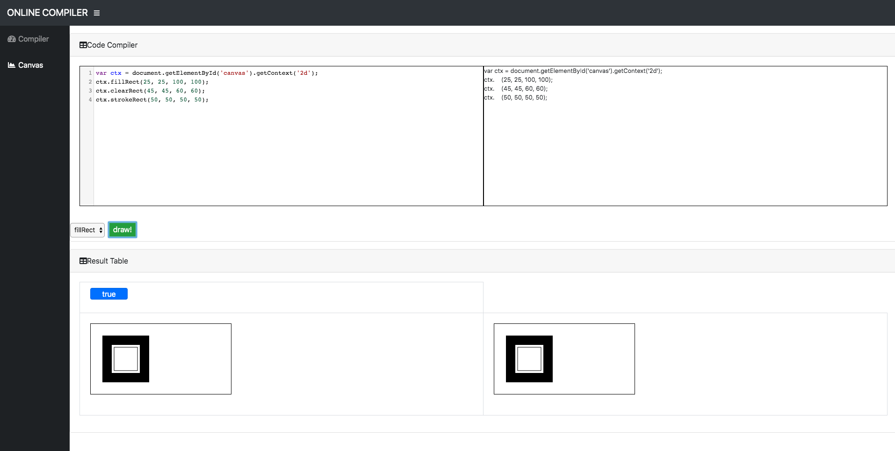

# online_compiler

 

## Introduction
This program is online compiler.  

- Javascript code & run (compile)  
- Python code & run (compile)  
- Java code & run  
- Draw a canvas with JavaScript

Write code to solve the algorithm.

- factorial
- gcd
- fibonacci

 

Write the code and draw the same picture on the canvas.

- fillRect
- triangle
- smile

 

## Installation
Install node module

 

    npm install

 

## Start
Need to build for start

 

    npm run build
    
 

scripts: webpack --config webpack.config.js

  

and start server. The server is a node server.

 

    npm start

 

scripts : "npm-run-all --parallel watch:server watch:build"

 

---

##### MIT License

###### Copyright (c) 2019 kim sangyeon

###### Permission is hereby granted, free of charge, to any person obtaining a copy of this software and associated documentation files (the "Software"), to deal in the Software without restriction, including without limitation the rights to use, copy, modify, merge, publish, distribute, sublicense, and/or sell copies of the Software, and to permit persons to whom the Software is furnished to do so, subject to the following conditions:

###### The above copyright notice and this permission notice shall be included in all copies or substantial portions of the Software.

###### THE SOFTWARE IS PROVIDED "AS IS", WITHOUT WARRANTY OF ANY KIND, EXPRESS OR IMPLIED, INCLUDING BUT NOT LIMITED TO THE WARRANTIES OF MERCHANTABILITY, FITNESS FOR A PARTICULAR PURPOSE AND NONINFRINGEMENT. IN NO EVENT SHALL THE AUTHORS OR COPYRIGHT HOLDERS BE LIABLE FOR ANY CLAIM, DAMAGES OR OTHER LIABILITY, WHETHER IN AN ACTION OF CONTRACT, TORT OR OTHERWISE, ARISING FROM, OUT OF OR IN CONNECTION WITH THE SOFTWARE OR THE USE OR OTHER DEALINGS IN THE SOFTWARE.
